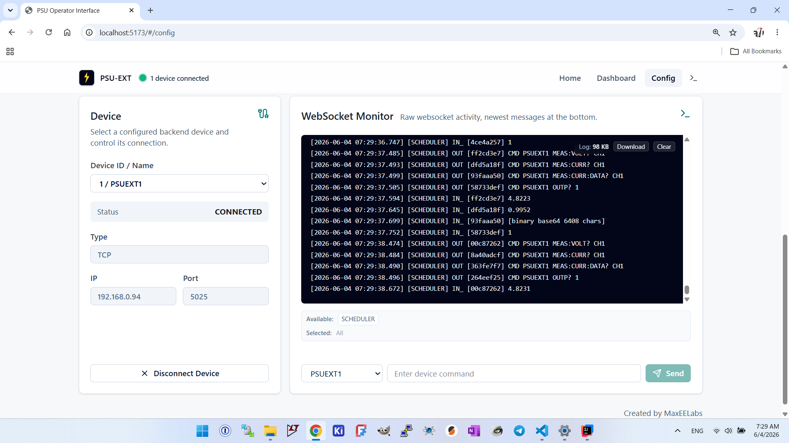

  

<h1 align="center">PSU-EXT Software</h1>

  Browser-based control for SCPI-driven power supply units — 
  Java backend, PC-side script runner, React operator dashboard.

  
  

  
  

## Subprojects

- [`psu-be/`](psu-be/README.md) — Java 17 / Spring Boot backend: the
  WebSocket proxy bridging browser clients to SCPI transports, plus the
  PC-side script runner for hardware automation.
- [`psu-fe/`](psu-fe/README.MD) — Vite + React frontend: the operator
  dashboard and device configuration UI.
- [`psu-install/`](psu-install/) — Go-based Linux and Apple Silicon macOS
  installer and `psu-ext` command-line manager. It installs a user-local
  release under `~/.psu-ext`, manages the Proxy, Script Runner, and Caddy
  services, and preserves device and script data between updates.

## Installation

Linux and Apple Silicon macOS release assets include a native `psu-ext` command.
After installing the command, run `psu-ext install` to download and configure
the local stack, then `psu-ext start` to launch it. The command prints the
browser URL and also supports `stop`, `status`, `logs`, and `update`.

## Contributing

See [CONTRIBUTING.md](CONTRIBUTING.md) for the DCO sign-off requirement and
third-party notice conventions. Repository maintainers should follow
[RELEASE.MD](RELEASE.MD) when publishing tagged releases.

## License

Licensed under the [Apache License, Version 2.0](LICENSE). See
[NOTICE](NOTICE), [psu-be third-party notices](psu-be/THIRD-PARTY-NOTICES.md),
and [installer third-party notices](psu-install/THIRD-PARTY-NOTICES.md) for
third-party attributions.
