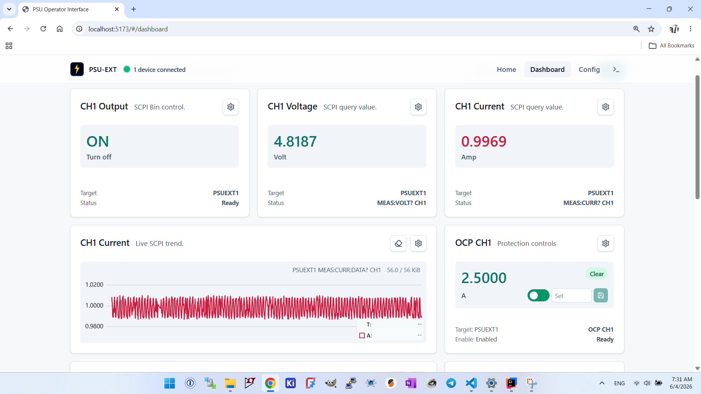

# PSU-EXT Software

Software workspace for PSU-EXT: a browser-based control surface for
SCPI-driven power supply units, backed by a Java service layer and a
PC-side script runner.

## Subprojects

- [`psu-be/`](psu-be/README.md) — Java 17 / Spring Boot backend: the
  WebSocket proxy bridging browser clients to SCPI transports, plus the
  PC-side script runner for hardware automation.
- [`psu-fe/`](psu-fe/README.MD) — Vite + React frontend: the operator
  dashboard and device configuration UI.

## Contributing

See [CONTRIBUTING.md](CONTRIBUTING.md) for the DCO sign-off requirement and
third-party notice conventions.

## License

Licensed under the [Apache License, Version 2.0](LICENSE). See
[NOTICE](NOTICE) for third-party attributions.
