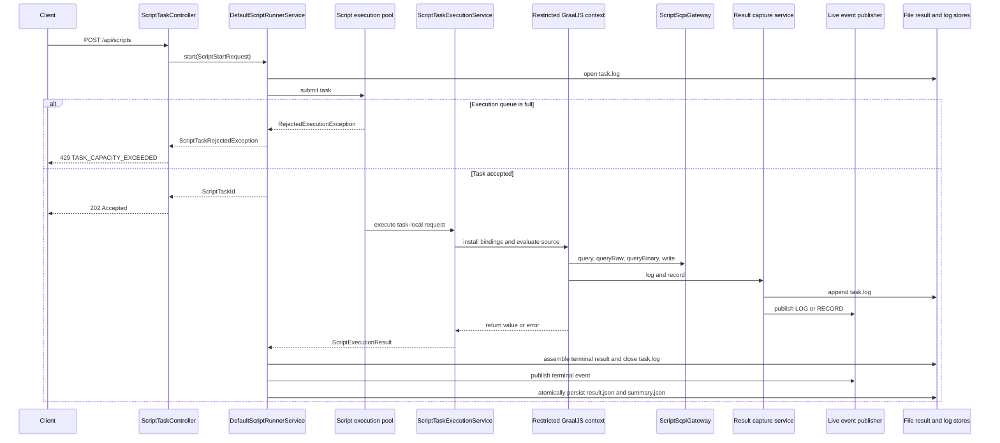

# PSU-BE Script Runner

`psu-be-script-runner` is the dedicated PC-side JavaScript task runner for
PSU-EXT SCPI scripting.

Run JavaScript measurement and control sequences against configured
SCPI devices. A script can set instrument state, query measurements, collect
time-series samples, report progress, write an operational log, return a task
result, and stream live events to an HTTP client.

## Quick Start

### 1. Configure a device

The default configuration reads `./devices.json`. Add a TCP device profile,
then adjust its address and port for the target PSU:

```json
[
  {
    "id": 0,
    "name": "PSU1",
    "type": "TCP",
    "ip": "192.168.4.1",
    "port": "5025",
    "baudrate": null
  }
]
```

The device profile API currently supports listing, connecting, and
disconnecting configured devices. Edit `devices.json` directly to add, modify,
or remove profiles.

### 2. Start the application and connect the device

From `software/psu-be`:

```powershell
.\mvnw.cmd -pl psu-be-script-runner spring-boot:run
```

In another PowerShell terminal, connect the named profile:

```powershell
Invoke-RestMethod -Method Post http://localhost:8081/api/devices/PSU1/connect
```

Use `GET /api/devices` to inspect configured profiles and their connection
state before submitting a script.

### 3. Submit and observe a script

```powershell
$source = @'
(() => {
  const voltage = query("PSU1", "MEAS:VOLT?");
  log("INFO", "Measured " + voltage + " V");
  record(new Date(), "voltage", "V", voltage);
  progress(1.0);
  return { voltage: voltage };
})();
'@

$request = @{
  name = "read-voltage"
  timeout = "30s"
  source = $source
} | ConvertTo-Json

$task = Invoke-RestMethod -Method Post -ContentType "application/json" `
  -Uri http://localhost:8080/api/scripts -Body $request

$terminalStates = "COMPLETED", "FAILED", "CANCELLED", "TIMED_OUT"
do {
  Start-Sleep -Milliseconds 200
  $status = Invoke-RestMethod "http://localhost:8080/api/scripts/$($task.taskId)"
} while ($status.state -notin $terminalStates)

$status
Invoke-RestMethod "http://localhost:8080/api/scripts/$($task.taskId)/result"
Invoke-WebRequest "http://localhost:8080/api/scripts/$($task.taskId)/log"
```

`POST /api/scripts/{taskId}/cancel` requests cooperative cancellation.
`GET /api/scripts/{taskId}/events` provides a Server-Sent Event stream for
progress, log, record, state, and terminal events. The complete endpoint list
appears in the HTTP API reference below.

## Operational Logging

The runner logs HTTP request boundaries, script task lifecycle transitions,
GraalJS execution outcomes, SCPI operation metadata, event subscriptions, and
durable storage/catalogue outcomes through SLF4J. Normal operational events
use `INFO`; high-volume diagnostics such as SCPI commands, result writes, and
event subscription changes use `DEBUG`; expected operational failures use
`WARN`; storage and infrastructure failures use `ERROR` with a stack trace.

The main logger categories are:

- `com.psuext.script.web` for HTTP controllers and API error translation.
- `com.psuext.script.execution.service` for task lifecycle.
- `com.psuext.script.execution.runtime` for GraalJS execution.
- `com.psuext.script.execution.scpi` for script-originated SCPI operations.
- `com.psuext.script.execution.storage` and `com.psuext.script.management`
  for durable task artifacts and script catalogues.

Enable additional runner diagnostics without changing unrelated application
logs:

```yaml
logging:
  level:
    com.psuext.script: DEBUG
```

Logs intentionally exclude JavaScript source, return values, script log and
record payloads, SCPI text/binary responses, and credentials. SCPI commands
are normalized, capped at 512 characters, and emitted only at `DEBUG`.

## Runtime Reference

This module is a dedicated Spring Boot application with embedded GraalJS
execution.

It is a dedicated Spring Boot application. It can be run independently from
`psu-be-proxy`. Its default configuration is in
`src/main/resources/application.yaml`; relative `devices.json` and
`script-storage` paths are resolved from the application working directory.

The public script task model lives under `com.psuext.script.execution.model`. These
records and enums define task identity, start requests, live snapshots,
terminal results, error details, and time-value series.

`ScriptStartRequest` defaults a missing timeout to five minutes. Terminal
`ScriptTaskResult` instances require `COMPLETED`, `FAILED`, `CANCELLED`, or
`TIMED_OUT` as the final status. Result collections are copied on construction
so stored results are immutable boundary objects.

The module includes Jackson Java time support because task results store
`Instant` values and will be persisted as `result.json`.

Script result and task-log storage are separate boundaries that share one
file-backed task-artifact directory:

```yaml
psu:
  scripts:
    storage:
      directory: script-storage
```

With the default directories, completed tasks are stored as:

```text
script-storage/<taskId>/result.json
script-storage/<taskId>/summary.json
script-storage/<taskId>/task.log
```

All durable artifacts for a task are kept together so inspection and cleanup
operate on one task directory.

### Saved script definitions

Saved script definitions are independent of script-task artifacts and are not
executed by this storage boundary. User definitions use a separate root and a
maximum UTF-8 source-code size:

```yaml
psu:
  scripts:
    management:
      user-directory: ./script-definitions
      maximum-source-code-size: 256KB
```

The file catalogue creates the user directory only when the first definition is
saved. Each user definition has an ID-specific directory containing immutable
metadata and the unmodified JavaScript source:

```text
script-definitions/<scriptId>/definition.json
script-definitions/<scriptId>/source.js
```

Builtin definitions are immutable, read-only resources below
`src/main/resources/scripts/builtin/`. Their `catalogue.json` manifest lists
the ID, display name, and normalized tags for each `<id>.js` file. Packaged
builtin sources are never copied into user storage and cannot be changed
through the API.

### PSU-EXT voltage calibration builtin

`calibrate-psu-ext-voltage` calibrates one PSU-EXT voltage channel using a
Siglent SPD4323X as the source and a Rigol DM858E as the reference meter. Edit
the device IDs, source channel, PSU-EXT channel, and optional relay control at
the start of the script before running it. The script uses the Rigol reading,
not the Siglent setpoint, for each calibration point. It always attempts to
switch the Siglent output off when it finishes, fails, or is cancelled.
Before starting, it aborts any unfinished PSU-EXT calibration transaction.
The default per-point settling time is 5 seconds, with a separate 1-second
delay after enabling the Siglent output. Cleanup returns the Siglent setpoint
to 0 V before it switches that output off.

The default 0, 1, 2, 3, 5, 8, 15, and 24 V series requires SPD4323X CH2 or CH3.
Connect the Rigol DC-voltage leads at the same physical point as the PSU-EXT
voltage channel. For CH1 measurement after the PSU-EXT output relay, set
`enablePsuExtOutput` to `true`.

### PSU-EXT voltage accuracy measurement builtin

`measure-psu-ext-voltage-accuracy` compares an already calibrated PSU-EXT
voltage channel with a Rigol DM858E while the Siglent SPD4323X supplies 42
voltages across the calibration intervals. It logs the requested setpoint,
Rigol reading, PSU-EXT reading, signed voltage error, and signed percentage
error for every point. Its returned result contains only per-range summaries
and the overall maximum absolute percentage error. The percentage calculation
is `(PSU-EXT - Rigol) / Rigol * 100`; 0 V is not a test point.

The default test takes about four minutes: five seconds of settling after each
source-voltage change, then consecutive Rigol and PSU-EXT reads. The Rigol
leads must connect at the same physical point as the selected PSU-EXT voltage
channel. The script returns the Siglent channel to 0 V and turns it off during
cleanup.

For interpretation only, the SPD4323X published voltage setting/readback
accuracy is ±(0.03% of reading + 10 mV). The DM858E published one-year DCV
accuracy is ±(0.06% of reading + 0.003% to 0.004% of range), depending on its
active range. See the [Siglent SPD4000X data sheet][siglent-spd4000x-data-sheet]
and [Rigol DM858 data sheet][rigol-dm858-data-sheet].

[siglent-spd4000x-data-sheet]: https://www.int.siglent.com/u_file/download/25_08_06/SPD4000X_DataSheet_EN01C.pdf
[rigol-dm858-data-sheet]: https://www.rigol.com/en_IN/products/multimeter/DM858.html

The script-source API manages reusable definitions. It is separate from the
task API: `/api/scripts` starts, observes, cancels, and retrieves execution
tasks, while `/api/scripts/source` lists and manages saved JavaScript source.

```text
GET    /api/scripts/source/builtin
GET    /api/scripts/source/builtin/{id}
GET    /api/scripts/source/user
POST   /api/scripts/source/user
GET    /api/scripts/source/user/{id}
PUT    /api/scripts/source/user/{id}
DELETE /api/scripts/source/user/{id}
```

Both list endpoints accept `limit` (default `100`, from `1` through `500`),
`offset` (default `0`), an optional case-insensitive `name` substring, and
repeatable `tag` query parameters. A list response contains `items`, `limit`,
`offset`, and `total`; its items include the ID, name, timestamps, origin, and
normalized tags but omit source code. Detail, create, and replace responses
include source code. The builtin endpoints are read-only; the user endpoints
create, replace, and delete only user definitions.

Saved source code must use the `(() => { … })();` wrapper. Comments may appear
before or after the wrapper. Its return value is captured as the task result
when the definition is submitted for execution.

For example, create a tagged user definition and retain the returned `Location`
header for later retrieval or execution submission:

```powershell
$body = @{
  name = "Read output voltage"
  sourceCode = '(() => { return { voltage: query("PSU1", "MEAS:VOLT?") }; })();'
  tags = @("measurement", "voltage")
} | ConvertTo-Json

Invoke-WebRequest -Method Post -ContentType "application/json" `
  -Uri http://localhost:8080/api/scripts/source/user -Body $body
```

Use `GET /api/scripts/source/user?tag=measurement&tag=voltage` to find tagged
definitions. To execute a saved source, read its detail response and submit
its `name` and `sourceCode` as the corresponding task request fields to
`POST /api/scripts`; definitions do not run automatically.

Task result assembly and script event capture are separate boundaries.
`Supplier<ScriptTaskResultAssembler>` is the Spring-backed entry point for
task-local result assembly. Each call creates a fresh prototype
`ScriptTaskResultAssembler`. A prototype `ScriptResultEventCaptureService` is
then created with that assembler and task log writer; it receives a fresh
prototype `ScriptSeriesRecordExtractor` from its supplier.

`ScriptTaskResultAssembler` owns only result assembly: task timestamps, captured
series, terminal status, completion time, and the one-time creation of a
terminal `ScriptTaskResult`.

`ScriptResultEventCaptureService` is the typed result-capture service used by
the GraalJS result bindings. It is created per running task with that task's
`ScriptResultEventSink` and `ScriptTaskLogWriter`. It receives validated
`log(...)` and `record(...)` callback data from the script boundary.
Log callbacks write readable per-task log lines only; they do not become
terminal result events. Record callbacks contribute only time-value series
points; they do not write task-log lines or terminal result events.

The result bindings validate JavaScript arguments before constructing the typed
callback payloads `ScriptLogEventData(level, message)` and
`ScriptRecordEventData(timestamp, series, unit, value)`. Payloads are validated
at the script boundary. A valid series record adds a `TimeValuePoint` to the
assembler's named series; assembled series metadata includes its sample count.

The intended script log shape is:

```javascript
log("INFO", "Output enabled");
```

Records that match the MVP series shape append points to the named time-value
series:

```javascript
record(new Date(), "voltage", "V", 12.34);
```

The script-facing SCPI boundary lives under `com.psuext.script.execution.scpi`.
`ScriptScpiGateway` exposes only the operations the script runtime needs:
`write(...)`, `queryText(...)`, `queryBinary(...)`, raw `send(...)`, and
`deviceExists(...)`.

The script execution boundary is organized under `com.psuext.script.execution`:
models, services, runtime bindings, result capture, SCPI access, storage, and
configuration remain exclusive to task execution. Saved script-definition
management is a separate future boundary under `com.psuext.script.management`;
it does not reuse task lifecycle or task-artifact infrastructure.
`RestrictedGraalJsContextFactory` creates a new context with host access, class
lookup, IO, native access, and thread creation disabled. `ScriptBindings`
composes separate SCPI (`query`, `queryRaw`, `queryBinary`, `write`), task
control (`sleep`, `cancelled`, `progress`), and result (`log`, `record`)
binding collaborators. `ScriptExecutor` owns
context lifetime, evaluates the required `(() => { … })();` wrapper directly,
captures its return value, and maps execution failures to `ScriptTaskError`.

`queryBinary(device, command)` returns the complete SCPI definite-length
binary block, including the `#<n><length>` header, as a base64 string. Scripts
own any command-specific binary parsing. `sleep(milliseconds)` is interruptible
when cancellation is requested and rejects values above
`psu.scripts.execution.maximum-sleep`, which defaults to five minutes.
`cancelled()` returns the task-local cancellation flag. `progress(value)`
accepts values from `0.0` through `1.0`, updates the task snapshot, and emits a
live `PROGRESS` event. Cancellation is cooperative: a cancellation request
moves the task to `CANCELLING`, sets `cancelled()` to `true`, and interrupts
`sleep(...)`. A task becomes `CANCELLED` only after execution exits. If it
does not exit before its configured deadline, it becomes `TIMED_OUT`.

## Script Submission Flow



The terminal result is assembled before `task.log` is closed. The terminal live
event is emitted after log close, then the result and summary files are
persisted. A client can use the task status, result, log, or events endpoints
independently.

## Script Bindings

Scripts run in a restricted GraalJS context. They do not receive Java class
access, filesystem access, IO, native access, or thread creation. All binding
arguments are validated before the operation starts; invalid values fail the
task with `SCRIPT_EXECUTION_FAILED`.

### SCPI

```javascript
// query(device, command): parsed scalar reply (number or trimmed string)
const voltage = query("PSU1", "MEAS:VOLT?");

// queryRaw(device, command): trimmed reply text without scalar conversion
const identity = queryRaw("PSU1", "*IDN?");

// queryBinary(device, command): complete SCPI definite-length block as base64
const encodedBlock = queryBinary("PSU1", "MEAS:VOLT:DATA? CH1");

// write(device, command): send a non-query command
write("PSU1", "OUTP ON");
```

Each SCPI function requires exactly two non-blank strings. `queryBinary(...)`
includes the SCPI `#<n><length>` header in its base64-encoded value; scripts
must perform command-specific binary parsing. SCPI operations reject a task
whose cancellation was already requested.

### Task Control

```javascript
// sleep(milliseconds): non-negative integral duration, bounded by maximum-sleep
sleep(250);

// cancelled(): current cooperative-cancellation flag
if (cancelled()) {
  return { cancelled: true };
}

// progress(value): inclusive range from 0.0 to 1.0
progress(0.5);
```

`sleep(...)` is interrupted by cancellation. `cancelled()` takes no arguments
and reports state without throwing. `progress(...)` emits a live `PROGRESS`
event and rejects values outside the inclusive range.

### Results

```javascript
// log(level, message): DEBUG, INFO, WARN, or ERROR plus a non-blank message
log("INFO", "Output enabled");

// record(timestamp, series, unit, value): timestamp must be a JavaScript Date
record(new Date(), "voltage", "V", 12.34);
```

`log(...)` writes one readable line to `task.log` and emits a live `LOG` event.
`record(...)` appends a point to the named result series and emits a live
`RECORD` event. It does not add a task-log line.

## Example Script

This measurement sequence exercises device writes, scalar and raw queries,
binary retrieval, task logging, time-series recording, progress, delay, and
cooperative cancellation. It leaves command-specific binary decoding to the
caller by returning the base64-encoded SCPI block.

```javascript
const device = "PSU1";
const samples = 5;

const identity = queryRaw(device, "*IDN?");
log("INFO", "Connected to " + identity);

write(device, "OUTP ON");
log("INFO", "Output enabled");

const readings = [];
for (let index = 0; index < samples; index += 1) {
  if (cancelled()) {
    log("WARN", "Measurement cancelled after " + index + " samples");
    return { identity: identity, readings: readings, cancelled: true };
  }

  const voltage = query(device, "MEAS:VOLT?");
  const current = query(device, "MEAS:CURR?");
  const timestamp = new Date();
  record(timestamp, "voltage", "V", voltage);
  record(timestamp, "current", "A", current);
  readings.push({ timestamp: timestamp.toISOString(), voltage: voltage, current: current });
  progress((index + 1) / samples);

  if (index + 1 < samples) {
    sleep(250);
  }
}

const waveformBlock = queryBinary(device, "MEAS:VOLT:DATA? CH1");
write(device, "OUTP OFF");
log("INFO", "Output disabled; sequence completed");

return {
  identity: identity,
  samples: readings,
  waveformBlockBase64: waveformBlock,
  cancelled: false
};
```

`ScriptRunnerService` is the application entry point for task execution. Its default
implementation creates one background task runtime, opens its task log,
executes the script, handles timeout and cancellation, stores the terminal
result, and exposes immutable task snapshots and results. Task execution uses a
fresh task-local result assembler, capture service, and script binding graph.

An in-memory, transport-neutral live event publisher emits
ordered `STARTED`, `CANCELLING`, `LOG`, `RECORD`, `PROGRESS`, `COMPLETED`,
`FAILED`, `CANCELLED`, and `TIMED_OUT` events with task-local sequence numbers.
Subscribers receive events through bounded asynchronous queues, so a slow
observer does not block script execution. A bounded per-task replay history
supports subscribers that attach after events have already been emitted.
Completed task snapshots and their live-event streams are retained in memory
for one hour, with a maximum of 500 completed tasks. Configure these limits:

```yaml
psu:
  scripts:
    runtime:
      maximum-completed-tasks: 500
      completed-task-retention: 1h
```

Live events are separate from durable `result.json` and `task.log` storage;
the HTTP/SSE adapter streams them independently of script execution.

Script execution and live-event delivery use separate bounded executors. A
full script execution queue rejects submission with HTTP `429` and the stable
`TASK_CAPACITY_EXCEEDED` error; a saturated delivery executor closes only the
affected live-event subscription. Configure the limits independently:

```yaml
psu:
  scripts:
    executors:
      execution-pool-size: 4
      execution-queue-capacity: 100
      event-delivery-pool-size: 2
      event-delivery-queue-capacity: 100
```

Stored terminal result summaries are available through
`ScriptRunnerService.listResults(...)`. `ScriptResultQuery` supports recent
result listing, terminal-status filtering, and offset/limit paging. Results are
ordered newest-first by completion time. `ScriptRetentionPolicy` is the
cleanup boundary. The default `RecentScriptRetentionPolicy` retains the 50
most recent results; when a 51st result is stored, the oldest result directory
is deleted.

File storage is the only supported durable storage implementation. Its task
artifact root is configured as follows:

```yaml
psu:
  scripts:
    storage:
      directory: script-storage
```

Each result directory contains an atomically published `result.json` and a
small `summary.json` index. Listing and retention read the index rather than
deserializing complete result payloads; incomplete, corrupt, and orphaned
entries are ignored.

The dedicated application also exposes a device manager HTTP API under
`/api/devices`. `GET /api/devices` lists configured profiles and current
transport status; the status contains only its lifecycle `state` and optional
`lastError`, while transport type and connection address remain in the device
profile. `POST /api/devices/{idOrName}/connect` and
`POST /api/devices/{idOrName}/disconnect` delegate to the shared
`ConnectionManagementService`, which uses the configured `devices.json` file
and the existing TCP/USB transport implementations. Device profile add,
modify, and delete endpoints are present but return `501 Not Implemented`.

HTTP request and response DTOs are separated by adapter responsibility:
task DTOs live in `com.psuext.script.web.execution.model` and device DTOs live
in `com.psuext.script.web.device.model`. Reusable task domain models remain
under `com.psuext.script.execution.model`, while connection and transport
models remain in their owning modules.

OpenAPI JSON is available at `/v3/api-docs` and Swagger UI at `/swagger-ui.html`.
The registry path remains configurable through `psu.connection.devices.file`:

```yaml
psu:
  connection:
    devices:
      file: devices.json
```

The default `application.yaml` also configures TCP and USB transport timeouts
and line framing. Override these values, script storage, runtime retention, or
executor limits through Spring Boot configuration for a deployment.

The browser device-manager widget calls this API from the Vite development
origin. Script Runner permits `http://localhost:5173` by default. Override
`psu.web.cors.allowed-origin` when the frontend is hosted elsewhere.
The Config Script page's **Test Connection** action calls
`GET /actuator/health` using the endpoint fields currently on screen; it does
not save those fields.

The script task HTTP API provides task lifecycle/result operations, log
streaming, and SSE event streaming are separate HTTP adapters with shared task
identifier parsing and error translation. `GET /api/scripts/{taskId}/log`
streams the log in fixed-size chunks instead of building the full file in memory.
Use optional zero-based character `offset` and character `limit` query parameters
to retrieve a bounded range. Omitting them streams the full log for download:

```text
POST /api/scripts
GET /api/scripts/{taskId}
GET /api/scripts/{taskId}/result
GET /api/scripts/{taskId}/series?series=voltage&offset=0&limit=1000
GET /api/scripts/{taskId}/series/csv?series=voltage&download=true
GET /api/scripts/{taskId}/log
GET /api/scripts/{taskId}/log?offset=0&limit=65536
GET /api/scripts/{taskId}/log?download=true
GET /api/scripts/{taskId}/log?download=true&downloadName=log_task-name_2026-07-29T08-30-00Z.txt
POST /api/scripts/{taskId}/cancel
GET /api/scripts?limit=100&offset=0
GET /api/scripts/{taskId}/events
```

`GET /api/scripts/{taskId}/result` preserves the existing result response shape, but includes only the first
point in each series. Use the per-series endpoint for a bounded JSON point page, or the CSV endpoint for a direct
download. Both endpoints stream `result.json` with Jackson and do not load a complete series into memory. CSV starts
with quoted `name` and `unit` metadata rows, followed by the `timestamp,value` header and ISO-8601 timestamps. The
`offset` and optional `limit` parameters are point-based;
omit `limit` to stream the remaining points.

The events endpoint is Server-Sent Events with task-local sequence IDs. It
replays retained events after the optional `afterSequence` query parameter,
removes the subscription on disconnect, and completes after the terminal
event. The simulator-backed `ScriptControllerSimulatorTest` uses
`FakeScpiTcpServer` from `psu-be-test-support` and verifies the device connect,
script submit, status, result, log, list, and SSE flows. Unit runner tests use
a deterministic `ScriptTaskExecutor`; execution tests retain the real GraalJS
binding graph with the SCPI simulator; storage tests exercise indexed durable
results, retention, and file behavior.

Simulator-backed tests use the canonical SCPI identity response
`PSU-EXT,PSU-EXT,TEST-0001,0.1.0` for `*IDN?`. The running-server HTTP test uses
Spring Boot 4 `RestTestClient` with `@AutoConfigureRestTestClient`.

An opt-in physical-device smoke test is available as
`RealDeviceScriptRunnerIT`. Edit the USB port, device name, and script constants
directly in that test. It is disabled by default and normal builds do not access
hardware. When enabled locally, use:

```powershell
.\mvnw.cmd -pl psu-be-script-runner -Dtest=RealDeviceScriptRunnerIT test `
  -Dpsu.script.real-device.enabled=true
```

The test registers and connects the configured USB device before starting the
runner, then reads the task log and verifies the terminal result and measured
series.

The production adapter, `ConnectionManagementScriptScpiGateway`, delegates to
`ConnectionManagementService`. It validates query/write command intent before
sending, maps transport errors into `ScriptScpiException`, accepts control
success for writes, returns text responses for text queries, and returns only
binary blocks for binary queries.

It is intended to own:

- script task lifecycle
- restricted JavaScript execution
- injected SCPI host functions
- task result creation
- per-task log writing
- result storage interfaces
- the script-specific application entry point
- future script REST and Server-Sent Events endpoints

The module uses the GraalVM Polyglot API directly. It does not use the legacy
JSR-223 `ScriptEngine` integration.

It depends on `psu-be-connection` and should call
`ConnectionManagementService` for device access. It must not create its own TCP
or USB clients.

`psu-be-proxy` stays proxy-only. This module must not depend on
`psu-be-proxy`, and script submission must not be added to the proxy WebSocket
protocol.

## Development Commands

From `software/psu-be`:

```powershell
.\mvnw.cmd -pl psu-be-script-runner test
.\mvnw.cmd -pl psu-be-script-runner spring-boot:run
```
